## Título: Evaluación de la ecoeficiencia en cafetales de Veracruz

Director de tesis: Dr. Carlos Roberto Cerdán Cabrera

Codirector: Dr. Ricardo Musule Lagunes

Asesor: Dr. Leonardo Vásquez Ibarra

Asesor externo: Dr. Charles Staver

## Antecedentes

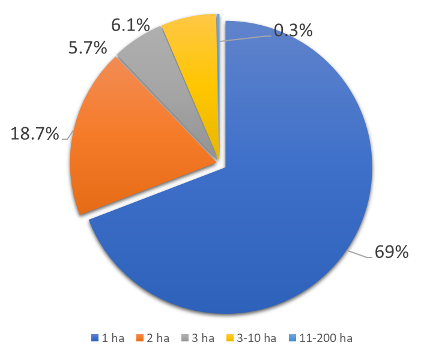{fig-align="center" width="442"}

Figura 1. Cantidad de hectáreas por productores de café *Coffea arabica* L. (Ramírez *et al*. 2010)

## Rendimientos de café

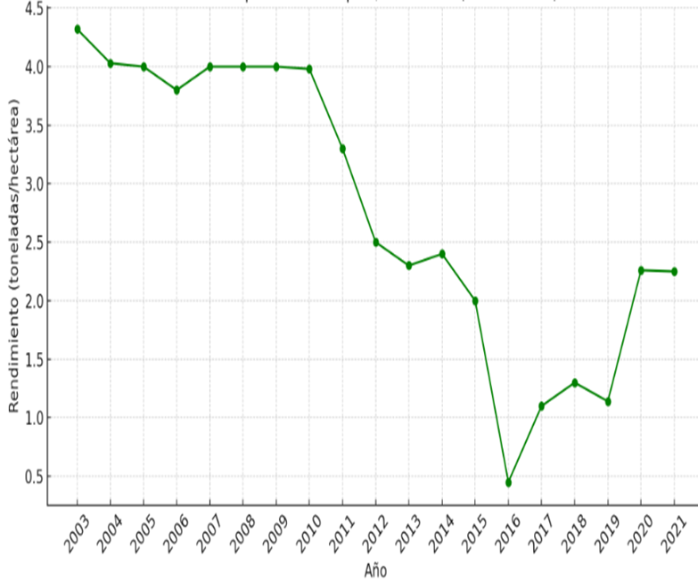{fig-align="center" width="533"}

Figura 2. Rendimiento/ha de café cereza en Coatepec. (OBSERVACAFÉ, 2022)

## Justificación

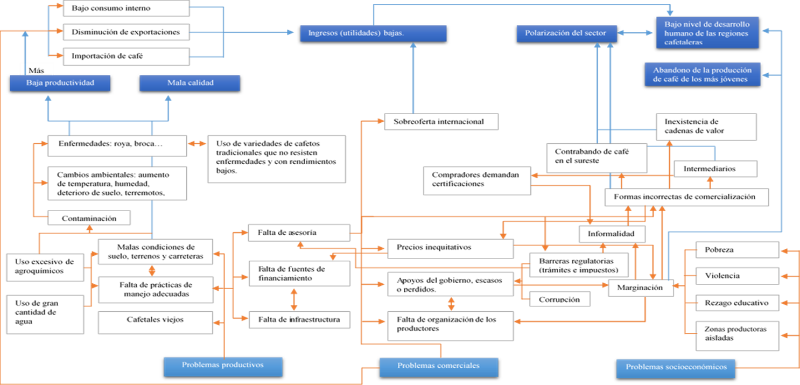{fig-align="center" width="502"}

Figura 3. Árbol de problemas del sector cafetalero a nivel nacional.

Fuente: Higuera y Rivera (2018) adaptado de Escamilla (2018), OIC (2017), Medina et al. (2016), SIAP (2015).

## Justificación

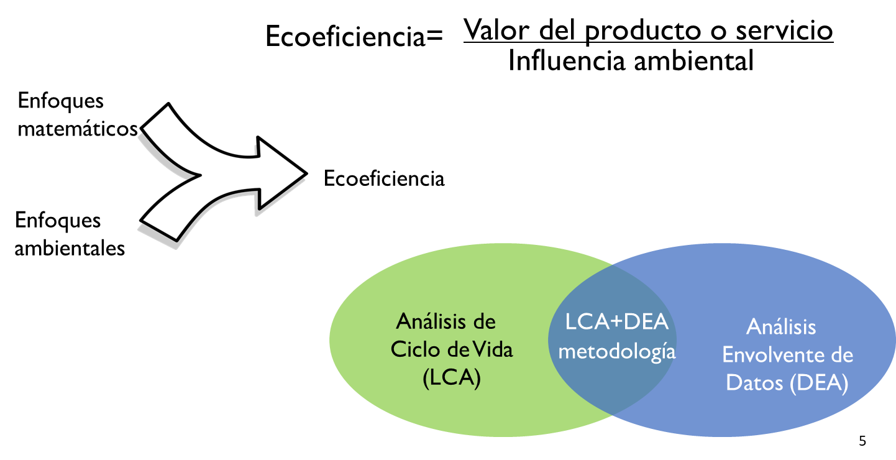

## Justificación

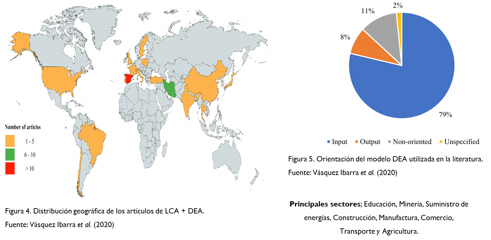

## Contexto

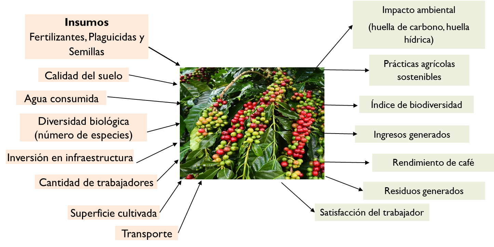

## Pregunta de investigación

¿Cómo varía el nivel de ecoeficiencia de fincas cafetaleras en una microcuenca de la zona central Veracruz utilizando el Análisis de Ciclo de Vida y Análisis Envolvente de Datos?

## Hipótesis

Existen diferencias significativas en la ecoeficiencia entre fincas cafetaleras en una microcuenca de la zona central Veracruz, asociadas al desempeño ambiental (LCA) y la eficiencia técnica (DEA).

## Objetivo general

Evaluar la ecoeficiencia de fincas cafetaleras en una microcuenca de la zona central Veracruz mediante la aplicación combinada del Análisis de Ciclo de Vida y el Análisis Envolvente de Datos (DEA), con el fin de identificar buenas prácticas productivas y ambientales.

## Objetivos particulares

1.  Aplicar el Análisis de Ciclo de Vida para identificar el desempeño ambiental de las fincas cafetaleras.
2.  Seleccionar las variables de entrada (insumos) y salida (rendimiento/productividad) aplicables al modelo DEA seleccionado.
3.  Determinar la relación entre eficiencia y la productividad con la aplicación combinada del Análisis de Ciclo de Vida y el Análisis Envolvente de Datos.

## Materiales y Métodos

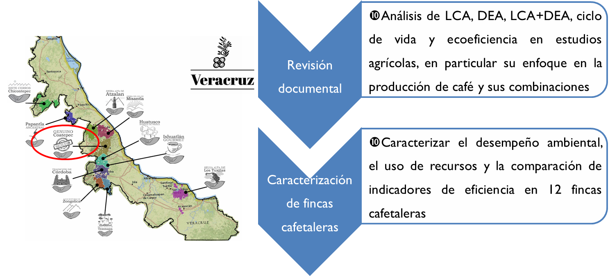{fig-align="center" width="531"}

## Análisis estadístico

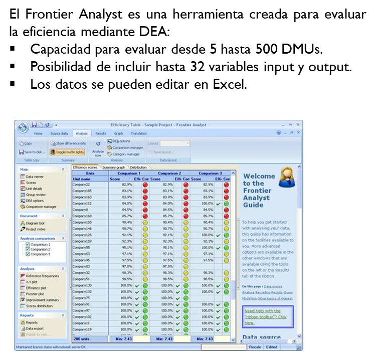{width="517"}

## Análisis estadístico

Tabla 1. Combinación de correlación de Pearson y rangos de eficiencia.

{width="427"}

Fuente: Elaboración propia.

## Resultados

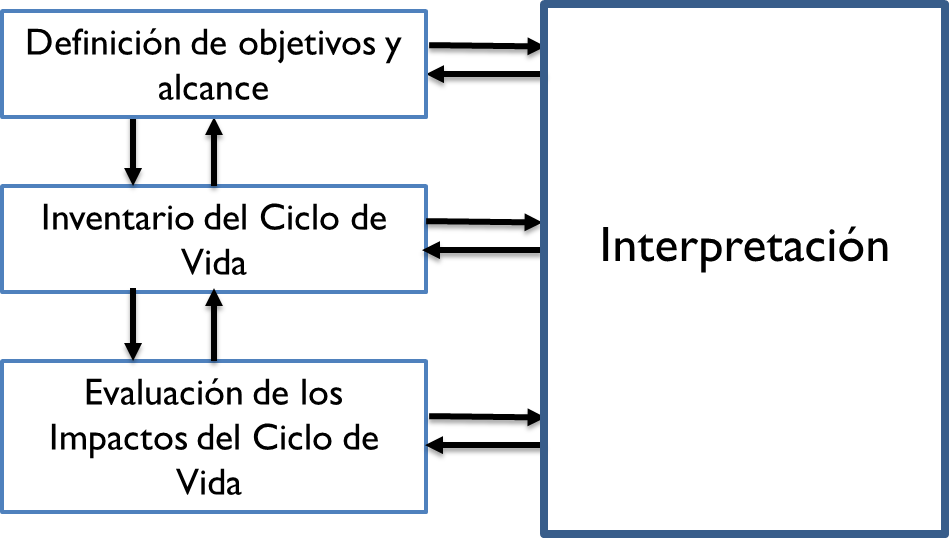

Figura 6. marco de referencia del Análisis de Ciclo de Vida.

Fuente: Norma ISO 14040: 2006.

## Resultados

El Análisis envolvente de datos es una técnica no paramétrica que permite evaluar la eficiencia de los productores de café al analizar los recursos empleados y los resultados obtenidos (fincas), especialmente en situaciones con múltiples entradas y salidas (Riaño y Larrea, 2021).

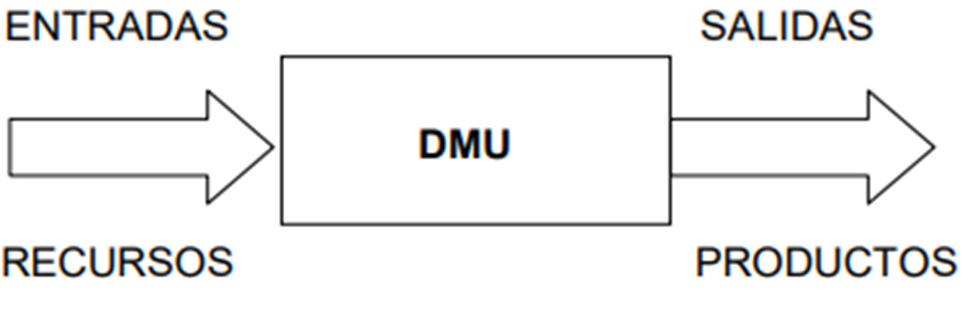{fig-align="center" width="485"}

## Resultados

Tabla 2. Variables de entradas

{width="548"}

Fuente: Elaboración propia

## Resultados

Tabla 3. Variables de salidas.

{fig-align="center" width="601"}

Fuente: Elaboración propia

## Resultados

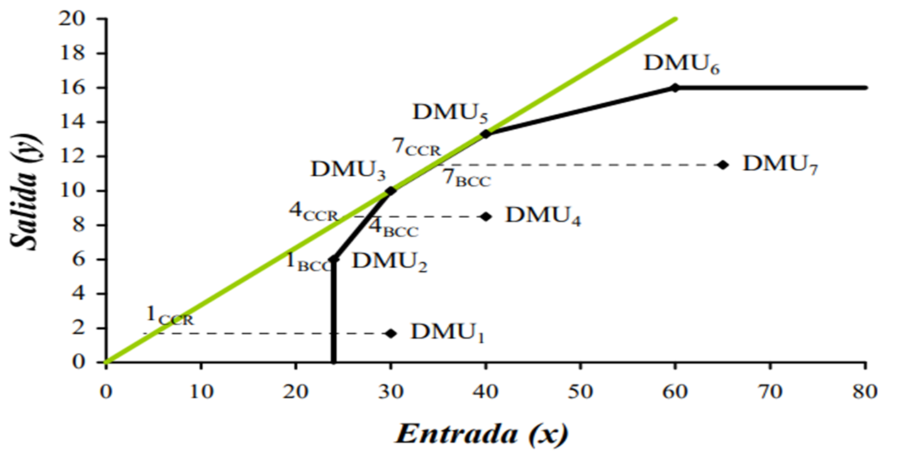{fig-align="center" width="570"}

Figura 5. Comparación entre los modelos CCR y BCC.

Fuente: Cooper *et al*. (2007)

## Resultados

Metodología LCA+DEA: método de cuatro pasos.

{fig-align="center" width="548"}

Fuente: Rebolledo-Leiva *et al*. (2017)
