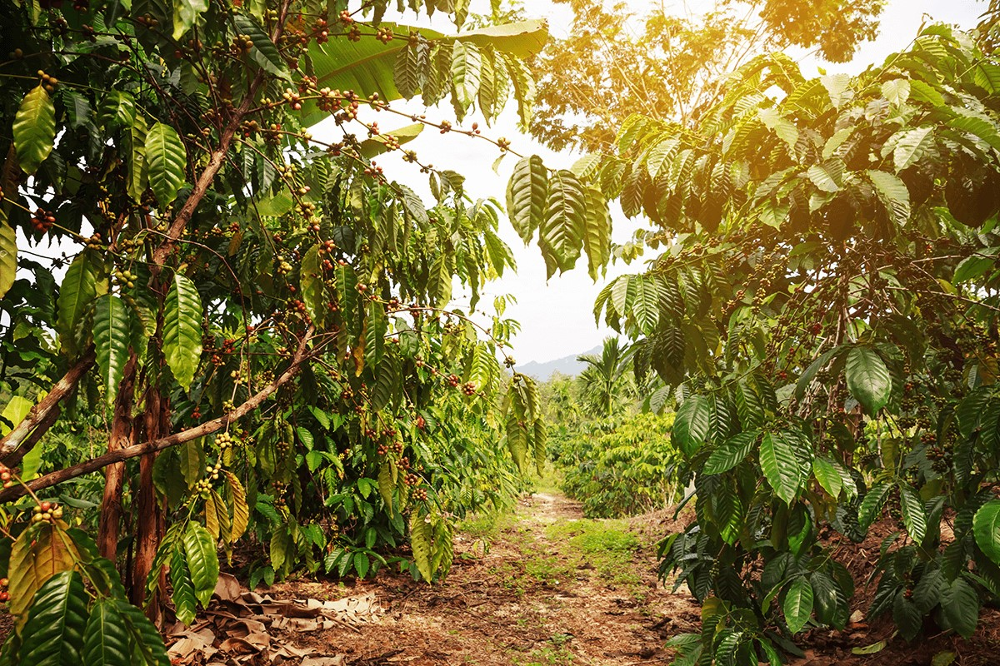
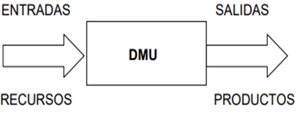
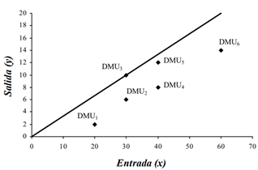
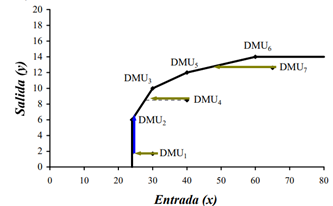

{width="503"}El Análisis Envolvente de Datos es una técnica no paramétrica cuyas primeras aplicaciones se remontan a 1978 [@riañohenao2022]. Su origen se encuentra en la investigación doctoral de Rhodes, quien evaluaba la eficacia del programa de educación Follow-Through en las escuelas públicas de Estados Unidos. No obstante, el desarrollo de esta técnica no se debe exclusivamente a Rhodes. También es fundamental reconocer la contribución de Charnes, Cooper, Banker, Färe, Grosskopf, Seiford y Thrall, quienes desempeñaron un papel crucial en el desarrollo de los modelos matemáticos que sustentan el DEA [@taoumi2023].

Los métodos de selección de variables persiguen, primordialmente, ordenar un conjunto de variables (inputs y outputs) definidas para evaluar a las Unidades de Toma de Decisiones (DMUs) usando modelos DEA, con el propósito de seleccionar un número restringido de variables, a manera de mantener la relación causal en los modelos y que éstos indiquen adecuadamente el desempeño de las DMUs evaluadas [@peças2019].

El DEA es una técnica no paramétrica que permite evaluar la eficiencia de los productores de café al analizar los recursos empleados y los resultados obtenidos, especialmente en situaciones con múltiples entradas y salidas [@riañohenao2022a].

{fig-align="center"}

[@charnes1978] fueron los pioneros en desarrollar el método de Análisis Envolvente de Datos (DEA), un enfoque no paramétrico que no requiere una estructura específica para definir la frontera de eficiencia. Esto permite comparar la eficiencia técnica sin necesidad de conocer previamente una función de producción. El DEA es una metodología de optimización diseñada para medir la eficiencia relativa de las unidades organizacionales (DMU's, por sus siglas en inglés de Decision Making Units, o Unidades de Toma de Decisión).

En este orden de ideas, el uso de metodologías para evaluar la eficiencia, como el DEA, se ha consolidado como una herramienta clave en el ámbito de la investigación. Se ha sido desarrollado a partir de los planteamientos teóricos de Farrell en 1957 según Cooper *et al*., y desde entonces ha sido ampliamente aplicado en diversas disciplinas [@börner2017].

Este enfoque se utiliza para medir la eficiencia técnica y asignativa en sectores tan variados como la producción, la salud, el deporte, la educación, el medio ambiente, los recursos naturales, el transporte, la energía, el turismo y las finanzas, entre otros. En estos estudios, se emplean tanto técnicas paramétricas, basadas en desarrollos econométricos, como no paramétricas, que se fundamentan en la programación matemática. Ambas metodologías permiten evaluar el rendimiento de unidades productivas o sistemas, proporcionando información clave para la toma de decisiones y la mejora continua.

Por su parte, el uso del DEA en la cafeticultura permite analizar la eficiencia técnica de las unidades productivas, comparando entradas como insumos agrícolas y mano de obra, con salidas como volumen de producción e ingresos generados. En un estudio reciente realizado en Colombia, [@gaitán2022] identificó diferencias significativas en la eficiencia de las fincas cafetaleras asociadas a factores como la capacitación técnica, el acceso a tecnologías limpias y la diversificación productiva.

**Diferencia entre eficiencia técnica, económica y ecoeficiencia**

La eficiencia técnica se centra en maximizar la producción utilizando un conjunto fijo de insumos, sin tener en cuenta los costos ni las externalidades ambientales [@harya2024]. Se refiere a la capacidad de un sistema productivo para generar la mayor cantidad posible de producto con la mínima utilización de recursos, optimizando los procesos técnicos. Este enfoque prioriza el rendimiento productivo, ignorando aspectos financieros o impactos ecológicos.

La eficiencia económica se centra en maximizar la rentabilidad mediante la optimización de la relación entre costos y beneficios [@bhat2022]. Evalúa el uso de recursos desde una perspectiva monetaria, buscando generar el mayor ingreso posible con los menores costos de producción. Este enfoque prioriza la viabilidad financiera, asegurando que las decisiones de gestión resulten en un equilibrio óptimo entre los recursos invertidos y los retornos obtenidos.

En contraste, la ecoeficiencia incorpora el impacto ambiental como un criterio central, evaluando simultáneamente la productividad, los costos y las externalidades entre ellas las emisiones de carbono o la pérdida de biodiversidad [@cardoso2024]. Esta integración holística distingue a la ecoeficiencia dado que es un enfoque más completo para la sostenibilidad.

La ecoeficiencia trasciende las nociones tradicionales de eficiencia al exigir un equilibrio ético entre el bienestar humano y la conservación del capital natural, un aspecto que debería guiar las políticas agrícolas globales.

Así, la ecoeficiencia busca producir más con pocos recursos y menos daño ambiental. Mientras la eficiencia técnica y económica se enfocan en desempeño físico o financiero, la ecoeficiencia añade una dimensión ecológica. Por ello se plantea que la ecoeficiencia es clave en sistemas sostenibles, como los agrícolas dado que aporta una mirada distinta sobre el uso eficiente de los recursos.

Experiencias en México, Colombia y Costa Rica ilustran el potencial de la ecoeficiencia. Para el caso de México, según la [@verdugomorales2025] reportaron que los cafetales bajo sombra en Chiapas, que integran árboles nativos, aumentaron la biodiversidad en un 20% y redujeron el uso de agroquímicos en un 30%.

Del análisis en Colombia, la Federación Nacional de Cafeteros implementó un programa de café sostenible que mejoró los rendimientos en un 15% y disminuyó las emisiones en un 10% mediante la utilización de compost [@ferrucho2024].

Otro hallazgo fue en Costa Rica, las certificaciones como Rainforest Alliance han permitido a los productores reducir el consumo de agua en un 25% y aumentar sus ingresos en un 12% [@rubio-jovel2024]. Sin embargo, la falta de metodologías estandarizadas y el acceso limitado a financiamiento restringen la escalabilidad de las iniciativas [@broeckhoven2025].

Estas experiencias destacan la necesidad de integrar los conocimientos tradicionales de los productores, como el uso de cultivos intercalados, para enriquecer las estrategias ecoeficientes y garantizar su viabilidad a largo plazo.

### **2. Características**

-   **Método no paramétrico basado en programación matemática**: DEA utiliza técnicas de programación lineal para construir una frontera de eficiencia sin asumir una forma funcional específica para la relación entre insumos y productos. Esto significa que no requiere suposiciones previas sobre cómo los recursos se convierten en resultados, lo que lo hace adaptable a diferentes contextos, como fincas cafetaleras con diversas prácticas agrícolas, evitando sesgos derivados de modelos teóricos rígidos.

-   **Permite comparar fincas cafetaleras sin necesidad de una función de producción predefinida**: A diferencia de otros métodos que dependen de una ecuación matemática preestablecida para modelar la producción, DEA evalúa la eficiencia comparando directamente las fincas según su desempeño real en términos de insumos utilizados y productos generados. Esto permite analizar fincas con características heterogéneas (tamaño, tecnología, tipo de café) de manera objetiva y sin imponer estructuras rígidas.

-   **Identifica las unidades más eficientes y las que requieren mejoras**: DEA clasifica las fincas cafetaleras en eficientes e ineficientes al compararlas con una frontera de eficiencia construida a partir de las mejores prácticas observadas. Las fincas eficientes están en la frontera, mientras que las ineficientes se identifican con un puntaje que indica cuánto deben mejorar en el uso de insumos o en la producción para alcanzar la eficiencia, ofreciendo una guía clara para la optimización.

-   **Flexibilidad en el manejo de múltiples insumos y productos**: DEA permite evaluar la eficiencia considerando simultáneamente múltiples insumos (como mano de obra, fertilizantes, agua) y productos (como cantidad de café cosechado o ingresos generados), sin necesidad de asignar pesos subjetivos a cada uno.

-   **Orientación a la optimización**: DEA puede configurarse con diferentes orientaciones, como la minimización de insumos (lograr el mismo nivel de producción con menos recursos) o la maximización de productos (aumentar la producción con los mismos recursos), adaptándose a los objetivos específicos del análisis.

-   **Identificación de referencias (benchmarks)**: DEA no solo señala las unidades ineficientes, sino que también identifica las unidades eficientes que sirven como referencia o "mejores prácticas" para las demás, proporcionando metas alcanzables y ejemplos prácticos de mejora.

-   **Capacidad para incorporar restricciones contextuales**: DEA puede adaptarse para incluir restricciones específicas del entorno, como limitaciones ambientales, tecnológicas o económicas, lo que permite un análisis más realista y ajustado a las condiciones de las fincas cafetaleras.

### **3. Metodologías Comunes**

-   **Modelo CCR (Charnes, Cooper y Rhodes):** Asume rendimientos constantes a escala.

Este modelo de DEA, desarrollado por Charnes, Cooper y Rhodes en 1978, asume rendimientos constantes a escala (CRS), lo que implica que un aumento proporcional en los insumos genera un aumento proporcional en los productos. Evalúa la eficiencia técnica global de unidades de decisión (como fincas cafetaleras) comparando insumos y productos para determinar cuáles operan en la frontera de eficiencia, sin considerar variaciones en la escala de operación.

{fig-align="center" width="405"}

-   **Modelo BCC (Banker, Charnes y Cooper):** Considera rendimientos variables a escala.

    Desarrollado por Banker, Charnes y Cooper en 1984, este modelo de DEA asume rendimientos variables a escala (VRS), reconociendo que el tamaño o escala de las unidades de decisión (como fincas cafetaleras) puede influir en su eficiencia. Evalúa la eficiencia técnica pura, separando los efectos de la gestión de los efectos de escala, permitiendo comparaciones más precisas entre unidades de diferentes tamaños.

{fig-align="center" width="408"}

-   **Modelos orientados a insumos o productos:** Dependiendo de si se busca minimizar costos o maximizar producción.

    Modelos orientados a insumos o productos: En el Análisis Envolvente de Datos (DEA), los modelos pueden orientarse hacia insumos o hacia productos, dependiendo del objetivo del análisis. La **orientación a insumos** se centra en minimizar los recursos utilizados (como mano de obra, fertilizantes o agua en fincas cafetaleras) para lograr un nivel dado de producción, siendo ideal para contextos donde se busca reducir costos o mejorar la eficiencia en el uso de recursos escasos. Por otro lado, la **orientación a productos** se enfoca en maximizar la producción (como la cantidad de café cosechado o ingresos generados) utilizando un nivel fijo de insumos, lo que es útil cuando el objetivo es aumentar los resultados sin incrementar los recursos. Ambos enfoques permiten adaptar el análisis a las prioridades específicas de las fincas, ya sea optimizando costos operativos o incrementando la productividad, y se implementan mediante programación lineal para identificar la frontera de eficiencia y las mejoras necesarias en cada caso.

### **4. Tendencias Actuales**

-   **Combinación de DEA con análisis de big data en agricultura.**

La integración del DEA con el análisis de big data está transformando la evaluación de la eficiencia en la agricultura al combinar la capacidad del DEA para medir la eficiencia relativa con el manejo de grandes volúmenes de datos provenientes de tecnologías avanzadas, como sensores, imágenes satelitales, drones y plataformas IoT (Internet de las cosas). Esta combinación permite procesar datos en tiempo real sobre variables como el clima, la calidad del suelo, el uso de agua y la productividad de los cultivos, generando modelos de eficiencia más precisos y dinámicos. Por ejemplo, el DEA puede identificar fincas cafetaleras eficientes, mientras que el big data proporciona patrones y tendencias (como predicciones de rendimiento o riesgos climáticos) que enriquecen el análisis, permitiendo a los agricultores optimizar recursos, reducir costos y adoptar prácticas más sostenibles. Esta sinergia facilita la toma de decisiones informadas, adaptadas a las condiciones específicas de cada parcela, y promueve la agricultura de precisión.

-   **Uso en evaluación de impactos económicos y ambientales simultáneamente.**

El DEA se utiliza cada vez más para evaluar simultáneamente los impactos económicos y ambientales de sistemas agrícolas, integrando métricas de desempeño financiero (como costos de producción y rentabilidad) con indicadores ambientales (como emisiones de carbono, uso de agua o degradación del suelo). Esta aproximación permite a los productores y responsables de políticas identificar fincas cafetaleras que logran un equilibrio entre viabilidad económica y sostenibilidad ambiental, promoviendo prácticas que minimicen el impacto ecológico sin comprometer los ingresos. Por ejemplo, el DEA puede evaluar cómo la reducción de fertilizantes químicos afecta tanto los costos como la calidad del suelo, ayudando a diseñar estrategias que optimicen el uso de recursos y reduzcan externalidades negativas, como la contaminación por nitratos o la pérdida de biodiversidad. Esta tendencia es clave para alinear la producción agrícola con los Objetivos de Desarrollo Sostenible, especialmente en contextos vulnerables al cambio climático.

-   **Aplicación en certificaciones de producción sostenible.**

El DEA se está aplicando para respaldar certificaciones de producción sostenible, como Veriflora® o Rainforest Alliance, al proporcionar una metodología objetiva para evaluar la eficiencia de las prácticas agrícolas en términos de sostenibilidad. Esta herramienta permite medir cómo las fincas cafetaleras cumplen con criterios de certificación, como el uso eficiente de recursos, la reducción de insumos químicos y la conservación de la biodiversidad, comparándolas con estándares de mejores prácticas. Por ejemplo, el DEA puede identificar fincas que optimizan el uso de agua y energía mientras mantienen altos rendimientos, ayudando a validar su elegibilidad para certificaciones ecológicas. Además, al combinarse con tecnologías como el big data, el DEA facilita el monitoreo continuo de indicadores de sostenibilidad, asegurando la transparencia y autenticidad de los productos certificados, lo que responde a la creciente demanda de consumidores por alimentos producidos de manera responsable.

### **5. Limitaciones**

-   **Requiere datos homogéneos y comparables.**

El DEA depende de la calidad y consistencia de los datos utilizados para comparar las unidades de decisión, como fincas cafetaleras. Esto implica que los datos de insumos (por ejemplo, cantidad de fertilizantes, horas de trabajo, agua utilizada) y productos (como kilogramos de café cosechado o ingresos) deben ser homogéneos en términos de unidades de medida, período de recolección y contexto operativo. En la práctica, las fincas pueden variar en factores como el tipo de cultivo, las condiciones climáticas o las prácticas de gestión, lo que dificulta la comparabilidad. Si los datos no son uniformes o están incompletos, los resultados del DEA pueden ser sesgados o poco fiables, limitando su capacidad para reflejar con precisión la eficiencia relativa de las unidades analizadas. Por ejemplo, comparar fincas con diferentes sistemas de riego o variedades de café sin ajustes previos puede distorsionar las conclusiones.

-   **No identifica causas de ineficiencia, solo señala su existencia.**

    Aunque el DEA es efectivo para identificar cuáles fincas cafetaleras son ineficientes y cuánto deben mejorar para alcanzar la frontera de eficiencia, no proporciona información sobre las razones subyacentes de esa ineficiencia. Por ejemplo, una finca puede ser clasificada como ineficiente debido a un uso excesivo de fertilizantes o una baja productividad, pero el DEA no indica si esto se debe a prácticas de gestión deficientes, limitaciones tecnológicas, problemas climáticos o factores socioeconómicos. Esta limitación requiere que los usuarios complementen el análisis con otras herramientas o estudios cualitativos para diagnosticar las causas específicas de la ineficiencia y diseñar estrategias de mejora adaptadas a cada caso, lo que puede implicar un esfuerzo adicional en la interpretación de los resultados.

-   **Sensible a valores atípicos en los datos.**

El DEA es altamente sensible a valores atípicos (outliers) en los datos, ya que estos pueden distorsionar la construcción de la frontera de eficiencia. En el contexto de fincas cafetaleras, un valor atípico podría ser una finca con rendimientos excepcionalmente altos debido a condiciones excepcionales (como un microclima único) o un error en la recolección de datos (por ejemplo, un registro incorrecto del uso de insumos). Estos valores extremos pueden hacer que la frontera de eficiencia sea poco representativa, afectando la evaluación de otras fincas y clasificando erróneamente algunas como ineficientes. Para mitigar esta limitación, es crucial realizar una limpieza rigurosa de los datos y, en algunos casos, aplicar técnicas estadísticas o ajustes en el modelo DEA para reducir el impacto de los outliers, asegurando resultados más robustos y confiables.

### **6. Principales Resultados**

#### **Mundo**

-   **Aplicaciones en estudios de eficiencia agrícola en Europa y Asia**.

El DEA ha sido ampliamente utilizado en Europa y Asia para evaluar la eficiencia técnica y económica de sistemas agrícolas, proporcionando una herramienta clave para identificar prácticas óptimas y áreas de mejora en contextos diversos. En Europa, estudios como los de [@bravo-ureta2006] han empleado DEA para analizar la eficiencia técnica (TE) en cultivos como trigo, maíz y arroz, reportando eficiencias promedio de entre 70% y 75% en sistemas de riego, con variaciones según el nivel de tecnificación y las condiciones regionales. Por ejemplo, en países como España e Italia, el DEA se ha usado para evaluar huertos de cítricos deficitariamente irrigados, destacando cómo la adopción de riego por goteo mejora la eficiencia hídrica [@angulo-meza2019].

En Asia, investigaciones en países como India y China han aplicado DEA para optimizar el uso de insumos en arrozales, revelando que factores como la experiencia del agricultor y el acceso a tecnologías de precisión pueden aumentar la TE hasta en un 20% [@taoumi2023a]. Además, el trabajo de [@vásquez-ibarra2020] en su artículo sobre la combinación de metodologías LCA y DEA destaca la utilidad de estas metodologías para evaluar la eficiencia en regiones agrícolas heterogéneas, integrando variables espaciales y socioeconómicas para identificar fincas de alto rendimiento en Europa y Asia, del total de artículos analizados el mayor porcentaje fue para España reconociendo que es el país que más utiliza estos enfoques con un total de 32 artículos, seguidos por Irán con 8 artículos y otros 16 países que han utilizado las diferentes metodologías en un rango de hasta 6 artículos por país. Estos estudios subrayan la capacidad del DEA para guiar políticas agrícolas que promuevan la productividad y la sostenibilidad en contextos regionales diversos.

-   **Uso en optimización del riego en cultivos tropicales**.

El DEA se ha consolidado como una herramienta clave para optimizar el riego en cultivos tropicales, donde la disponibilidad de agua y las condiciones climáticas son críticas. Estudios en regiones tropicales, han combinado DEA con LCA para evaluar la eficiencia hídrica en cultivos como maíz, plátano y sorgo en regiones como el Valle Bajo de Grijalva. Este trabajo reportó eficiencias técnicas promedio de 66% a 77%, destacando que las fincas con sistemas de riego tecnificados (como goteo) logran una mayor productividad hídrica frente a métodos gravitacionales. En Venezuela, investigaciones han utilizado DEA para analizar el café, un cultivo tropical clave, identificando que la renovación de cafetales y la mejora en la infraestructura de riego pueden incrementar la eficiencia hasta en un 24% [@colincastillo2024]. En Asia, estudios en arrozales de India han empleado DEA para optimizar el uso del agua, mostrando que la integración de sensores y datos satelitales con DEA puede reducir el consumo de agua en un 15-20% sin comprometer los rendimientos [@zhu2021]. Estos resultados, respaldados por autores reconocidos como Vásquez Ibarra, demuestran que el DEA no solo identifica ineficiencias en el uso del agua, sino que también guía la adopción de tecnologías de riego de precisión, promoviendo una agricultura más sostenible en climas tropicales.

#### **América Latina**

-   **Evaluación de eficiencia de pequeños productores en Colombia.**

El Análisis Envolvente de Datos (DEA) ha sido ampliamente utilizado en Colombia para evaluar la eficiencia técnica y asignativa de pequeños productores agrícolas, especialmente en cultivos como café, caña de azúcar y hortalizas, donde los pequeños productores enfrentan limitaciones de recursos y acceso a tecnología. Un estudio clave de [@jorgeandrés2007] analizó la eficiencia técnica en el sector cafetero colombiano utilizando DEA, encontrando que los pequeños productores alcanzaron eficiencias técnicas promedio de entre 60% y 70%, con variaciones según el acceso a capacitación y la adopción de prácticas agronómicas modernas. Los resultados indicaron que factores como la educación del agricultor, el acceso a crédito y la calidad del suelo son determinantes para mejorar la eficiencia.

Sobre la combinación de LCA y DEA en sistemas agrícolas se destaca cómo la heterogeneidad regional afecta la eficiencia, mostrando que los pequeños productores en regiones como Antioquia y el Valle del Cauca pueden mejorar hasta un 25% su eficiencia al adoptar tecnologías de riego y fertilización optimizadas.

Otro estudio relevante de [@favilatello2019] aplicó DEA para evaluar la eficiencia energética en la industria manufacturera colombiana, pero incluyó pequeños productores agroindustriales, reportando que la incorporación de tecnologías modernas incrementa la eficiencia en un 15-20% al reducir el consumo de energía y los costos asociados. Estos resultados subrayan la importancia de políticas públicas que promuevan la capacitación, el acceso a tecnología y la infraestructura para pequeños productores, permitiendo cerrar brechas de ineficiencia y mejorar la competitividad agrícola en Colombia.

-   **Identificación de buenas prácticas en Brasil y Perú**.

En Brasil y Perú, el DEA se ha utilizado para identificar buenas prácticas agrícolas que sirvan como referentes para mejorar la eficiencia de pequeños y medianos productores. En Brasil, un estudio de [@fontalvo-herrera2020] aplicó un modelo híbrido de DEA y programación lineal multiobjetivo para evaluar la eficiencia de productores de caña de azúcar, identificando que las fincas que implementan rotación de cultivos y manejo integrado de plagas alcanzan eficiencias técnicas superiores al 80%. Estas prácticas, combinadas con el uso de fertilizantes orgánicos y sistemas de riego por goteo, se destacaron como modelos replicables para optimizar recursos y reducir impactos ambientales.

En Perú, [@valdivia2022] emplearon DEA para analizar la eficiencia de pequeños productores de quinua en la región andina, encontrando que las fincas con acceso a asociaciones cooperativas y certificaciones de comercio justo logran eficiencias promedio de 75%, frente al 55% de las fincas sin estas prácticas. El estudio de [@vásquez-ibarra2020a] también resalta la relevancia de integrar DEA con análisis espacial para identificar buenas prácticas en cultivos tropicales en Perú, como el cacao, donde el uso de sombra natural y la diversificación de cultivos mejoran la eficiencia hídrica y económica en un 20-30%. Estas investigaciones destacan que las buenas prácticas identificadas, como la tecnificación del riego, la cooperación entre productores y la adopción de métodos sostenibles, no solo aumentan la eficiencia, sino que también fortalecen la resiliencia frente al cambio climático y mejoran los ingresos de los productores en ambos países.

#### **México**

-   **Evaluación térmica y financiera del proceso de secado de grano de café en un secador solar activo tipo invernadero**.

Segun los resultados de [@quintanarolguin2017] la forma más común de realizar el proceso de secado para obtener café pergamino seco a partir de café cereza, es exponiendolo a los rayos solares de manera directa y a la intemperie, donde la calidad final no siempre es óptima. Una alternativa para mejorar el proceso ha sido el aprovechamiento de la energía solar mediante el uso de secadores solares. Su propósito fue evaluar la eficiencia térmica y financiera del proceso de secado de grano de café en un secador solar activo tipo invernadero. El estudio se realizo durante el año 2014, en un secador solar tipo invernadero con colector integrado formando parte de la estructura, con circulación de aire forzada. El grano fue puesto en charolas hechas con bastidor de madera y malla sombra 80% con dimensiones de 0.3\*0.85 m, que sirvieron como camas de secado. La proporción de grano fue de 19.5 kg m-2. En 44 h de sol (5 días), se obtuvo un porcentaje de humedad del café pergamino de 11%. La eficiencia térmica del secador solar fue de 12%. Los resultados del flujo de efectivo descontado es positivo y la recuperación de la inversión se logra durante un periodo de cosecha (aproximadamente tres meses), que representa una alta viabilidad de uso de esta tecnología a nivel de pequeños productores.

-   **La sustentabilidad y la cultura cafetalera mexicana**

Los hallazgos presentados por [@morandinahuerma2023] los cafeticultores mexicanos enfrentan desafíos complejos con una variedad de temas entrelazados. El presente trabajo es un acercamiento a la compleja red que forma su problemática. Se llevaron a cabo 10 talleres de diagnóstico participativo en los cuatro estados con mayor producción de café en México: Chiapas, Veracruz, Oaxaca y Puebla. Dichos talleres se realizaron en coordinación con ocho organizaciones y en ellos se contó con la presencia de 312 actores sociales. Se identificaron 22 problemas y 23 fortalezas, así como, las relaciones entre ellos. Todo ello se concentró en tres temas centrales: capacidad organizativa, conocimiento y valores éticos, en una red de alta complejidad que genera vulnerabilidad ante intervenciones externas negativas y propicia la migración de jóvenes y la degradación ambiental. En aras de potencializar sus fortalezas es posible mejorar la cultura cafetalera y, en particular, la producción y la comercialización del aromático. El trabajo teórico en torno al concepto de sustentabilidad posibilita reconocer el valor del conocimiento tradicional de campesinos e indígenas, así como de sus relaciones comunitarias de cooperación y economías que les permiten intercambios, pero que no tienen como objetivo central la acumulación de valor monetario, sino la satisfacción de las necesidades humanas, individuales y comunitarias. El resultado de la reflexión abona a la mejor comprensión de las prácticas sustentables en términos funcionales.

-   **Sustentabilidad en la industria del café. Caffenio modelo de negocio.**

Refiere [@navarrete-torres2025] que la marca Caffenio nació oficialmente en 2017, aunque sus orígenes datan de 1941, con la fundación del negocio ‘Café Combate’ en Hermosillo, Sonora, México. Es una de las franquicias de café en el noreste del país, que además de ofertar bebidas frías y calientes, son conocidos por la alianza que sostienen con la cadena comercial OXXO, S. A. de C. V., a través de la cual venden la marca “Andatti”. Es una empresa líder dedicada al desarrollo de productos y onceptos diferenciados para segmentos específicos de mercado. Desarrollan 5 divisiones de negocio: Centros de consumo, Tiendas de conveniencia, Barras de café, Cafeterías y Soluciones para autoservicios y mayoristas. Se propuso analizar la estrategia de sostenibilidad que se denomina Crece Caffenio, de la cual se deriva Cosecha, el programa que impulsa el apoyo a productores de café para que sus fincas sean más rentables. Se encontró que las innovaciones aplicadas en la empresa conducen a mejorar significativamente la productividad de las organizaciones. El programa es integral y abarca todos los aspectos de la operación de la empresa. Los resultados llevan a plantear que las innovaciones en los procesos de producción de las cadenas de suministro sostenible en la agroindustria tienen tendencia a consolidarse en el mercado. Por tanto, la adopción de este enfoque en el diseño de la estrategia de las empresas se ha convertido en eje de trabajo para la alta gerencia, que percibe en la sostenibilidad un elemento clave para la competitividad. Por lo anterior, el desarrollo y fortalecimiento de la importancia de la sostenibilidad enfocado en el pilar social, ambiental, económico y ético es clave para que exista una colaboración entre quienes participan en el proceso productivo.

En regiones como Veracruz, México, esta perspectiva es especialmente pertinente, dado que la producción de café se caracteriza por una alta heterogeneidad en cuanto a tamaño de finca, sistemas de manejo y condiciones ecológicas[@beltrán-vargas2024]. Sin embargo, existe una escasez de estudios que apliquen este enfoque de manera localizada. Tal como señalan los autores anteriores, adaptar las metodologías de ecoeficiencia al contexto regional permite formular recomendaciones específicas para los productores y diseñar políticas públicas más efectivas en este sector.
