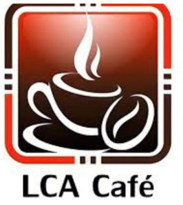
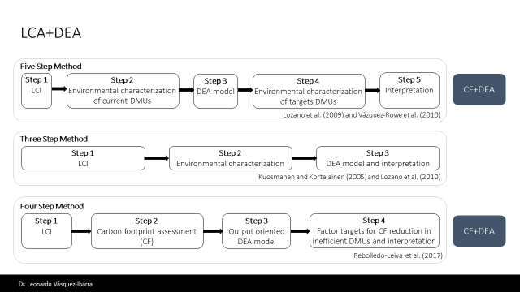
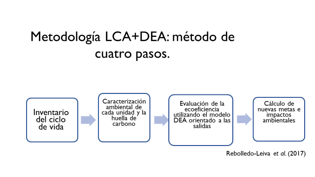

## 

## [liga](../../about.qmd)

## {width="441"}

El Análisis Ciclo de Vida (LCA) es un método analítico empleado para la evaluación del uso, transformación, consumo y destino de los recursos. A nivel mundial, a través de las normas internacionales ISO 14040 e ISO 14044, esta herramienta se considera integral en la medición y direccionamiento de la carga ambiental y la huella ecológica asociadas con la fabricación de un producto, un proceso o actividad, desde la cuna hasta la tumba[@finkbeiner2006].

En la agricultura, el LCA cuantifica indicadores como el consumo de agua, las emisiones de gases de efecto invernadero y la pérdida de biodiversidad [@notarnicola2017]. La metodología LCA permite medir el impacto ambiental de un producto desde la extracción de materias primas hasta su disposición final (ISO 14040, 2006). Por su parte, el DEA permite medir la eficiencia relativa de unidades productivas utilizando múltiples insumos y productos [@charnes1978].

En la producción agrícola y otras áreas, los impactos ambientales se pueden medir mediante diversos indicadores a través del LCA. Esta metodología permite evaluar los impactos ambientales de un producto o proceso a lo largo de toda su cadena de suministro, lo que ha llevado a su amplia adopción, especialmente en el ámbito agrícola[@angulo-meza2019]. Uno de los principales problemas ambientales es el calentamiento global (Alvarado et al., 2023), cuyo impacto se evalúa en LCA mediante la Huella de Carbono (FC). Este indicador estima las emisiones totales de gases de efecto invernadero asociadas a un producto o actividad a lo largo de su ciclo de vida [@garcia-freites2020].

Por su parte el Análisis de Ciclo de Vida es una técnica iterativa para evaluar la cadena de valor de un producto, servicio o sistema y conocer los posibles impactos asociados con su manufactura y consumo [@samper2017]. Es una herramienta poderosa para hacer comparaciones holísticas de los sistemas y para la correcta asignación de los recursos [@costa2018].

**Características**

El enfoque LCA ha sido aplicado en cafetales para identificar los puntos críticos del ciclo de vida del producto, como el uso del agua en el riego, la energía empleada en el beneficiado húmedo y las emisiones de Gases de Efecto Invernadero (GEI) durante el transporte [@trinh2019]. Estos estudios han demostrado que la fase agrícola es responsable de una proporción considerable del impacto ambiental total del café, lo que resalta la necesidad de intervención directa en las prácticas de cultivo.

-   Basado en normas ISO 14040 y 14044.

-   Evalúa impactos en múltiples categorías (uso del suelo, huella de carbono, consumo de agua).

-   Se aplica en diversas industrias, incluyendo la caficultura

El análisis del ciclo de vida de un producto es una metodología que **intenta identificar, cuantificar y caracterizar los diferentes impactos ambientales** potenciales, asociados a cada una de las etapas del ciclo de vida de un producto.

El Análisis del Ciclo de Vida es la recopilación y evaluación de las entradas, las salidas y los impactos ambientales potenciales de un sistema del producto a través de su ciclo de vida[@finkbeiner2006].

• Definición de objetivos y alcances: En esta fase se exponen los motivos por los que se desarrolla el estudio y se establece el alcance donde se define la amplitud, profundidad y detalle del estudio.

• Inventario del Ciclo de Vida (ICV): Durante esta etapa se identifican y cuantifican todas las entradas (consumo de recursos y materiales) y salidas (emisiones al aire, suelo, aguas y generación de residuos) que pueden causar un impacto durante el ciclo de vida de un producto. Los datos obtenidos en esta fase son el punto de partida para la evaluación de impactos del ciclo de vida.

• Evaluación de los Impactos del Ciclo de Vida (EICV): Durante esta etapa se relacionan las entradas y salidas seleccionadas en el inventario con los posibles impactos sobre el medio ambiente, la salud humana y los recursos, con el fin de clasificar, caracterizar y valorar la importancia que los potenciales impactos generan.

• Interpretación de resultados: La interpretación es la combinación de los resultados del (ICV) y la (EICV), con la finalidad de extraer, de acuerdo a los objetivos y alcances planteados, conclusiones y recomendaciones que permitan la toma de decisiones. A veces, puede implicar un proceso dinámico de revisión y actualización del alcance, así como de la naturaleza y la calidad de los datos recopilados para que sean coherentes con el objetivo y el alcance.

Existen diferentes metodologías para la integración de LCA, de acuerdo con [@vásquez-ibarra2021] estas son;

{fig-align="center"}

En esta oportunidad se resalta para el contexto actual de Veracruz, la Metodología LCA+DEA con el método de cuatro pasos.

{fig-align="center"}

**Metodologías Comunes**

-   Enfoque de Cuna a Puerta: Analiza desde la producción hasta la salida del producto de la finca.

-   Enfoque de Cuna a Tumba: Considera toda la vida del producto, incluyendo su disposición final.

{fig-align="center" width="512"}

### **Tendencias Actuales**

-   Uso de bases de datos específicas para cultivos tropicales.

-   Integración con modelos de cambio climático.

-   Análisis de escenarios para la reducción de emisiones.

    **Limitaciones**

<!-- -->

-   Requiere datos detallados y a menudo difíciles de obtener.

-   Puede ser costoso y complejo.

-   No siempre considera aspectos sociales.

**Principales Resultados**

#### **Mundo**

-   Implementación de LCA en certificaciones como Rainforest Alliance y Fair Trade.
-   Reducción de emisiones en el procesamiento de café en Europa.

#### **América Latina**

-   Estudios sobre huella hídrica y de carbono en Brasil y Colombia.

-   Optimización del uso de fertilizantes en cafetales peruanos.

#### **México**

-   Evaluaciones de impacto ambiental en cafetales de Veracruz y Chiapas.

-   Propuestas de mejora en procesos de beneficio húmedo de cultivos agrícolas.
