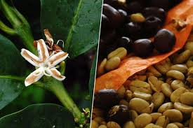
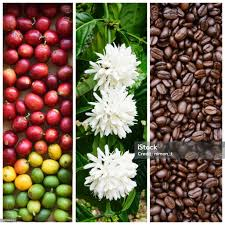
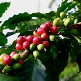
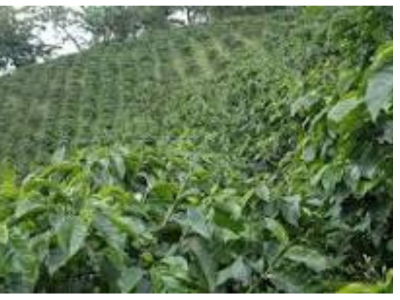

La ecoeficiencia es un enfoque que busca optimizar el uso de recursos en los sistemas productivos para reducir su impacto ambiental mientras se mantiene o mejora la productividad. En cafetales, la ecoeficiencia implica estrategias para minimizar el uso de insumos y reducir residuos sin comprometer la calidad del café.

Medir la eficiencia es crucial para optimizar el uso de recursos en cualquier sector, especialmente en el agropecuario, donde la maximización de la producción con insumos limitados puede tener un impacto significativo en la sostenibilidad económica y social[@cerveramuñoz2024].

{fig-align="center"}

En México de acuerdo con Becerril [@becerril-torres2010], el sector agropecuario enfrenta varios desafíos, entre los cuales destacan el crecimiento poblacional y la variación en el consumo según el tipo de población, la incertidumbre en los mercados debido a fluctuaciones en los precios y la disponibilidad de alimentos, la competencia entre alimentos destinados al consumo humano y aquellos destinados a la producción de agrocombustibles, y la reducción en la disponibilidad de agua y de tierras para la actividad agropecuaria. Para abordar estos retos, es fundamental contar con un conocimiento más profundo del sector.

{fig-align="center"}

En este contexto la producción de café es un proceso complejo que involucra múltiples factores, desde la elección de variedades adecuadas hasta el manejo de plagas y enfermedades. La eficiencia en la producción se traduce en un uso óptimo de recursos, lo que no solo mejora la rentabilidad para los agricultores, sino que también contribuye a la sostenibilidad del ecosistema [@leguizamo-sotelo2024]. Medir la eficiencia permite identificar áreas de mejora, optimizar prácticas agrícolas y maximizar la calidad del café producido.

{fig-align="center"}

La Figura 1 muestra el árbol de problemas del sector cafetalero a nivel nacional en México según hallazgos [@gonzálezrazo2019] adaptado de varios autores. Se ilustran las diversas problemáticas que enfrenta la industria del café en México, incluyendo factores como uso excesivo de agua y agroquímicos, falta de prácticas de manejo, falta de asesorías, malas condiciones de suelos, cafetales envejecidos, entre otros que se agrupan en problemas productivos, comerciales y socioeconómicos. Estas dificultades generan desigualdades en la cadena productiva, afectando especialmente a los productores más vulnerables. La representación visual permite identificar las interconexiones entre los problemas y sus consecuencias en el sector.

{fig-align="center"}

El sector cafetalero enfrenta diversas dificultades, como la inestabilidad de precios y las plagas, que afectan su rentabilidad y sostenibilidad. Para afrontar estos retos, es fundamental mejorar la eficiencia productiva, lo que aumentaría los ingresos y reduciría los impactos ambientales de malas prácticas agrícolas. Por ello integrar aspectos económicos y ambientales es clave para fortalecer la cadena de valor y fomentar un crecimiento equitativo del sector.

Otro aspecto clave de los problemas es la falta de metodologías adaptadas al contexto de los cafetales, lo que se dificulta al momento de tomar en cuenta la aplicación de herramientas como el LCA y el DEA en este sector. Esta metodología ha sido denominada por algunos autores como LCA+DEA, y se utilizará en adelante el término marco o metodología. A pesar de su potencial, la combinación de estas dos metodologías es poco frecuente en investigaciones previas, especialmente en estudios agrícolas, lo que representa una brecha en el conocimiento.

La ausencia de un marco común que unifique indicadores de eficiencia productiva e impactos ambientales dificulta evaluar la ecoeficiencia en la producción de café. Por ello, se requiere una metodología integrada, adaptada al contexto local, que genere resultados útiles para la toma de decisiones en fincas cafeteras y promueva la sostenibilidad del sector.

La evaluación de la ecoeficiencia en la producción de café (*Coffea arabica* L.) mediante el uso combinado de LCA+DEA ofrece una herramienta robusta y multidimensional para abordar tanto la eficiencia productiva, elementos financieros como los impactos ambientales. El DEA permite medir la eficiencia en el uso de recursos dentro de las fincas, mientras que el LCA proporciona una visión integral de los efectos ambientales a lo largo de todo el ciclo de vida del café, desde la siembra hasta la comercialización.

{fig-align="center" width="399"}

Al combinar ambos enfoques, es posible identificar no solo las fincas más productivas, sino también aquellas que minimizan su impacto ambiental, brindando así un análisis completo que facilita la toma de decisiones para mejorar la sostenibilidad en la producción cafetera. Esta metodología combinada representa una innovación en la evaluación de la ecoeficiencia agrícola, particularmente en el sector del café, al integrar aspectos productivos y ambientales en un solo marco de análisis.

Los factores relevantes en la relación del LCA+DEA y la sostenibilidad para las organizaciones incluyen la eficiencia, la productividad, la mejora, la estandarización y la eficiencia técnica. Se consideran factores asociados como ventas, oferta y demanda, materias primas, costo de mano de obra y la producción [@riañohenao2022].

**Importancia:**

-   Reduce costos de producción.

-   Disminuye la huella ambiental del café.

-   Mejora la competitividad en mercados internacionales con estándares de sostenibilidad.

**Indicadores Clave:**

-   Uso de agua por kilogramo de café producido.

-   Emisiones de gases de efecto invernadero por hectárea.

-   Eficiencia energética en el procesamiento

**Justificación**

Otro aspecto clave de los problemas es la falta de metodologías adaptadas al contexto de la producción de café (*Coffea arabica* L.), lo que se dificulta al momento de tomar en cuenta la aplicación de herramientas como el LCA y el DEA en este sector. A pesar de su potencial, la combinación de estas dos metodologías es poco frecuente en investigaciones previas, especialmente en estudios agrícolas, lo que representa una brecha en el conocimiento.

{width="392"}

En este orden de ideas, la falta de un marco común que unifique los indicadores de eficiencia productiva y los impactos ambientales específicos del café complica la evaluación precisa de la ecoeficiencia en este ámbito. Este problema plantea la necesidad de desarrollar una metodología que integre ambos enfoques LCA+DEA, adaptada a las condiciones locales, que permita generar resultados prácticos para la toma de decisiones en las fincas cafeteras y contribuir a la sostenibilidad del sector.

{fig-align="center" width="316"}

En Veracruz se pueden distinguir tres tipos de productores de café (Coffea arabica L.) pequeños productores o minifundistas, productores agrícolas o agroindustriales y productores secundarios, que son aquellos que no tienen como actividad principal el café. La gran mayoría de los productores son minifundistas y mantienen sus fincas como sistemas de policultivos y rústicos, el 93.5% de las fincas cafetaleras tienen una superficie menor a 3 ha[@venegassandoval2021].

La medición de la eficiencia técnica mediante el DEA es crucial para evaluar el rendimiento de las DMU en el uso de recursos. Permite identificar las mejores prácticas y establecer una frontera de producción empírica, facilitando la comparación entre unidades homogéneas que en la presente investigación serán las fincas cafetaleras en la región de Veracruz.

La justificación de esta investigación se basa en la escasez de estudios específicos para regiones como Veracruz, donde la mayoría de las investigaciones se han centrado en contextos globales o nacionales, limitando la comprensión de las particularidades locales. Otros estudios de DEA en agricultura han utilizado datos a nivel macro o nacional, sin considerar factores locales como las condiciones climáticas, variedades de cultivos y prácticas agrícolas, lo que afecta la precisión en la evaluación de la eficiencia.

La necesidad de evaluar la ecoeficiencia en la producción agrícola se ha vuelto crucial debido a los crecientes desafíos ambientales y la demanda de prácticas sostenibles. El DEA se ha consolidado como una herramienta útil para medir la eficiencia en sistemas productivos, ya que permite evaluar múltiples entradas y salidas sin la necesidad de especificar una función de producción. Su aplicación en la agricultura, especialmente en cultivos como el café, permite identificar las fincas que alcanzan los mejores niveles de eficiencia, lo cual es fundamental para mejorar el uso de recursos y reducir el impacto ambiental. No obstante, la DEA por sí solo no proporciona información detallada sobre los efectos ambientales, lo que subraya la importancia de complementarlo con otros métodos, como el LCA.

El Análisis de Ciclo de Vida es una metodología que evalúa los impactos ambientales de un producto desde su origen hasta su disposición final, ofreciendo una visión integral de los efectos de las actividades agrícolas. En la producción de café (*Coffea arabica* L.), el LCA permite identificar los puntos críticos en el proceso productivo que generan mayores impactos, como el uso de agua, energía y la emisión de gases de efecto invernadero. Combinando LCA con DEA, es posible no solo evaluar la eficiencia productiva de las fincas, sino también entender el impacto ambiental asociado a las prácticas agrícolas, proporcionando un enfoque más holístico de la ecoeficiencia. Esta combinación de herramientas es especialmente valiosa en la región cafetera, donde los desafíos ambientales y económicos requieren soluciones innovadoras que optimicen tanto la producción como la sostenibilidad.

{fig-align="center" width="313"}

Integrar LCA y DEA para evaluar la ecoeficiencia en la producción de café tiene un gran potencial para transformar las prácticas agrícolas en Veracruz y otras regiones cafeteras. Al combinar el análisis de eficiencia con la evaluación de los impactos ambientales, se pueden identificar las áreas en las que se puede mejorar el rendimiento productivo sin comprometer el bienestar ambiental. Esta metodología combinada no solo ayuda a las fincas a reducir costos y mejorar la competitividad, sino que también fomenta prácticas más responsables y alineadas con los principios de sostenibilidad. La propuesta de utilizar LCA+DEA ofrece una herramienta robusta y adaptada a las características específicas de la producción cafetera, permitiendo avanzar hacia un modelo más ecoeficiente y rentable.

{fig-align="center"}

Por su parte, el DEA se utilizará para evaluar la eficiencia productiva en la región cafetalera de Veracruz. Se propone combinar LCA y DEA, lo cual permite no solo evaluar la eficiencia productiva, sino también los impactos ambientales, logrando una ecoeficiencia integral en la producción de café en Veracruz. La ecoeficiencia se emplea para medir la eficiencia en la producción de café en las fincas y se ofrecen recomendaciones prácticas para mejorarla, integrando criterios ambientales y económicos específicos de la región de Veracruz.
